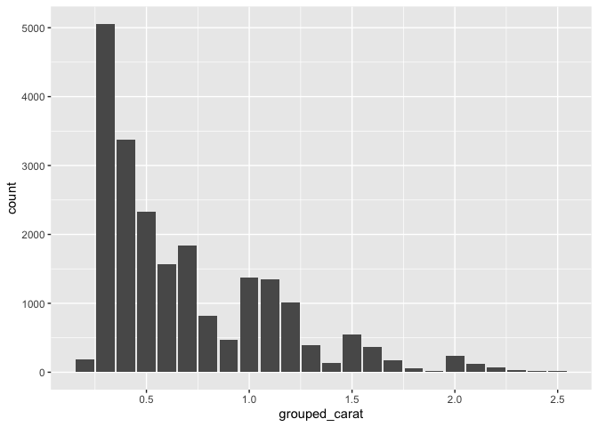
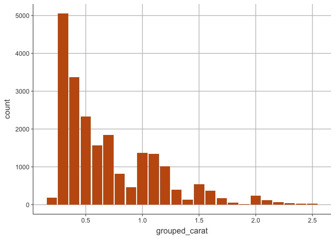
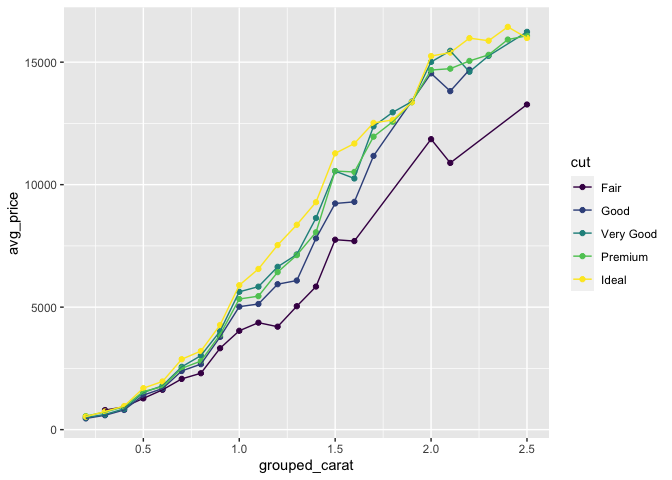
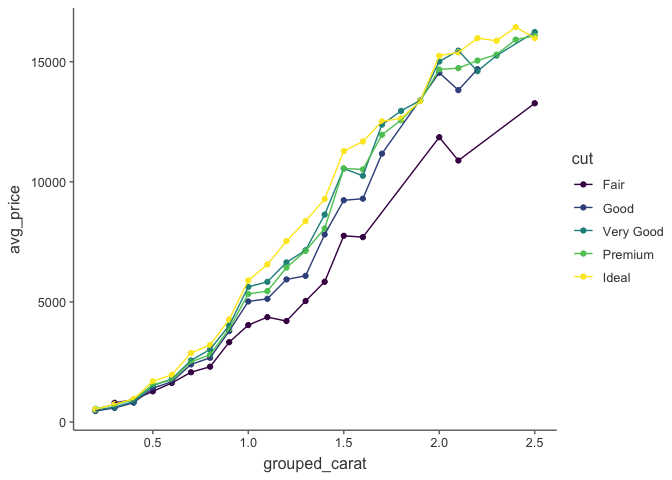
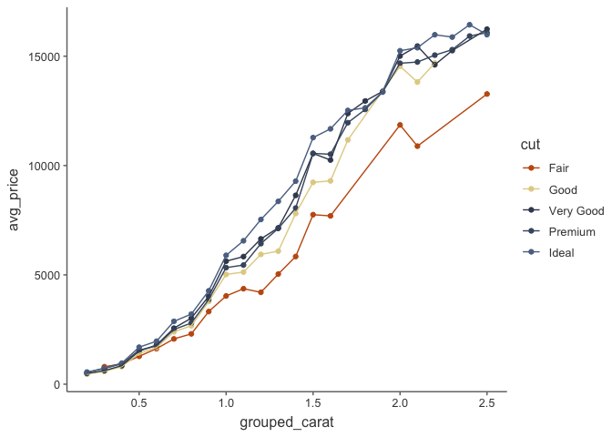
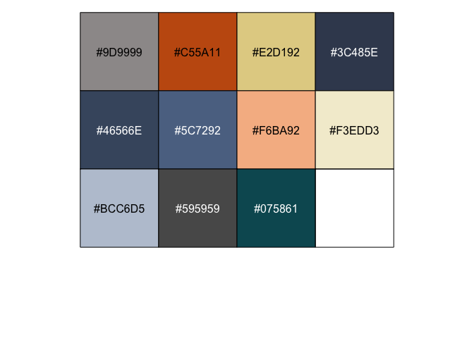
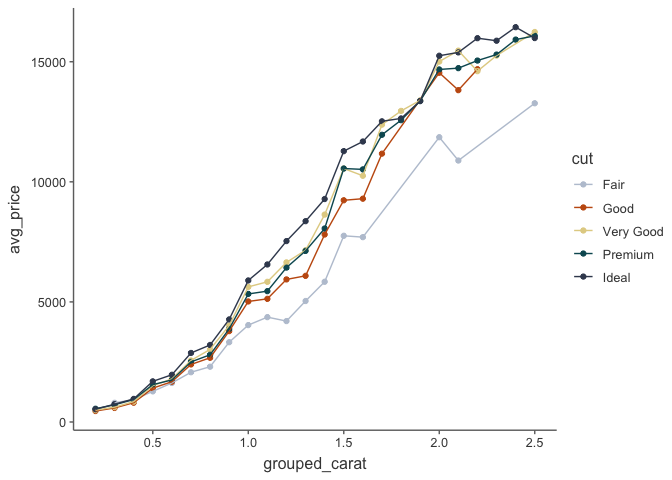
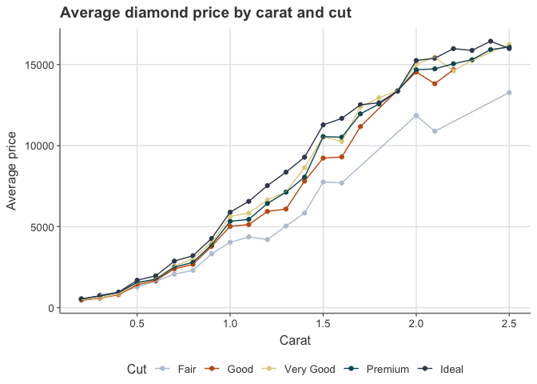

RSG Style Guide
================

The RSG style guide is designed to support Redstone staff in 1. writing
high-quality and reproducible code, and 2. generating compelling
visualizations. This guide is not an introduction to R, the tidyverse,
or Github. We recommend the following resources to get started in R:

  - R for Data Science manual by Hadley Wickham, creator of the
    tidyverse: <https://r4ds.had.co.nz/index.html>
  - The Tidyverse Cookbook:
    <https://rstudio-education.github.io/tidyverse-cookbook/index.html>

## File management

\[This is probably a fairly extensive section on how to properly use
github - let’s see what other existing resources are available for
this.\]

## File types

R code should typically be written in one of two types of files.

R Markdown (.Rmd) files. These files are best when conducting analyses
that can be contained to a single document, and/or which may be shared
with people outside of Redstone. R Markdown files have specific
advantages over .R files:

  - They can be Knit, which runs the entire code and generates a clean
    output file that includes all of the code and the relevant outputs
    (e.g., data tables, graphs, etc.), making it very easy for others to
    see the step-by-step process of loading, cleaning, and analyzing
    data.
  - They allow for written documentation or analysis to easily be
    interspersed with code and analysis, making them useful when you
    want to tell the story of what an analysis is showing.

.R files will typically be most valuable for tasks that are not purely
analysis focused. For example, when developing R packages, web
applications, etc., .R files may be the most effective/compatible with
other software.

## Code style

R is a high-level programming language used primarily for statistical
computing and graphics. The goal of the R Programming Style Guide is to
make our R code easier to read, share, and verify.

Redstone follows Google’s R Programming Style Guide, found here:
<https://google.github.io/styleguide/Rguide.html>. This style guide
draws on work from Hadley Wickham’s tidyverse style guide, found here:
<https://style.tidyverse.org/>.

The example below demonstrates an application of the style guide. Notice
in the code that all functions (for example, aes(), geom\_point()) are
called from the package (using the syntax “ggplot2::”). Those with
experience in R may be tempted to simply load the ggplot2 library,
thereby eliminating the need to call every function from the ggplot2
package. However, the Google R Style Guide recommends the approach below
because it accounts for cases where multiple packages have functions
with the same name (creaating confusion in R as to which function R
should call).

``` r
# load the diamonds dataset, included in the ggplot package
# the diamonds dataset contains the prices and other attributes of almost 54,000 diamonds

# this is the only library we load, in order to "pipe" data (use the %>% command) efficiently
library(magrittr)

diamonds <- ggplot2::diamonds

summarized_diamonds <-
  diamonds %>% 
  dplyr::mutate(grouped_carat = round(carat, 1)) %>% 
  dplyr::group_by(cut, grouped_carat) %>% 
  dplyr::summarise(
    avg_price = base::mean(price, na.rm = TRUE),
    count = dplyr::n()
  ) %>% 
  dplyr::filter(count > 10)
```

    ## `summarise()` has grouped output by 'cut'. You can override using the `.groups` argument.

## Visual style

Redstone has developed the rsgtheme package to style visuals generated
in R. This package leverages the tools of the ggthemr package which can
take in a specified palette (in this case, the RSG palette) and generate
visuals according to that palette. Many of the other aspects of the
graphics are pre-set through the function (e.g., gridlines, fonts, axes,
etc.), but can be altered using ggplot2 functions afterward.

Below, we demonstrate how to use the rsgtheme package to create
RSG-style plots.

First, we generate a basic plot using the diamonds dataset.

``` r
rsgtheme::rsgtheme_reset()

summarized_diamonds %>% 
  dplyr::filter(cut == "Ideal") %>% 
  ggplot2::ggplot(ggplot2::aes(x = grouped_carat, y = count)) + 
  ggplot2::geom_col()
```

<!-- -->

We’d like to change the plot to reflect RSG’s visual style. We do this
using the rsgtheme
package.

``` r
# We first run the rsgtheme() function, which changes the default theme for the document
rsgtheme::rsgtheme()

# We then generate the plot
summarized_diamonds %>% 
  dplyr::filter(cut == "Ideal") %>% 
  ggplot2::ggplot(ggplot2::aes(x = grouped_carat, y = count)) + 
  ggplot2::geom_col()
```

<!-- -->

``` r
# We then reset the theme to the default document settings
rsgtheme::rsgtheme_reset()
```

We can adjust the default chart layout to be as close to our desired
layout as possible by adjusting the input\_layout field of the
rsgtheme() function, as
follows

``` r
# We first run the rsgtheme() function, which changes the default theme for the document
# In this function, we specify the layout. Layout options include: "clean" (the default), "clear", "minimal", "plain", "scientific"

# Clear layout
rsgtheme::rsgtheme(input_layout = "clear")

# We then generate the plot
summarized_diamonds %>% 
  dplyr::filter(cut == "Ideal") %>% 
  ggplot2::ggplot(ggplot2::aes(x = grouped_carat, y = count)) + 
  ggplot2::geom_col()
```

<!-- -->

``` r
# We then reset the theme to the default document settings
rsgtheme::rsgtheme_reset()


# Minimal layout
rsgtheme::rsgtheme(input_layout = "minimal")

# We then generate the plot
summarized_diamonds %>% 
  dplyr::filter(cut == "Ideal") %>% 
  ggplot2::ggplot(ggplot2::aes(x = grouped_carat, y = count)) + 
  ggplot2::geom_col()
```

<!-- -->

``` r
# We then reset the theme to the default document settings
rsgtheme::rsgtheme_reset()


# Plain layout
rsgtheme::rsgtheme(input_layout = "plain")

# We then generate the plot
summarized_diamonds %>% 
  dplyr::filter(cut == "Ideal") %>% 
  ggplot2::ggplot(ggplot2::aes(x = grouped_carat, y = count)) + 
  ggplot2::geom_col()
```

<!-- -->

``` r
# We then reset the theme to the default document settings
rsgtheme::rsgtheme_reset()


# Scientific layout
rsgtheme::rsgtheme(input_layout = "scientific")

# We then generate the plot
summarized_diamonds %>% 
  dplyr::filter(cut == "Ideal") %>% 
  ggplot2::ggplot(ggplot2::aes(x = grouped_carat, y = count)) + 
  ggplot2::geom_col()
```

<!-- -->

``` r
# We then reset the theme to the default document settings
rsgtheme::rsgtheme_reset()
```

There are some special considerations when working with line charts in
particular. To demonstrate, we first generate a basic plot using the
diamonds dataset.

``` r
summarized_diamonds %>% 
  ggplot2::ggplot(ggplot2::aes(x = grouped_carat, y = avg_price, group = cut, color = cut)) + 
  ggplot2::geom_point() +
  ggplot2::geom_line()
```

<!-- -->

We’d like to change the plot to reflect RSG’s visual style. We first
attempt to do this using the rsgtheme() package
alone.

``` r
# We first run the rsgtheme() function, which changes the default theme for the document
rsgtheme::rsgtheme()

# We then generate the plot
summarized_diamonds %>% 
  ggplot2::ggplot(ggplot2::aes(x = grouped_carat, y = avg_price, group = cut, color = cut)) + 
  ggplot2::geom_point() +
  ggplot2::geom_line()
```

<!-- -->

``` r
# We then reset the theme to the default document settings
rsgtheme::rsgtheme_reset()
```

We see that the layout of the chart matches the theme, but the colors
are wrong. This is due to an underlying problem in the ggthemr package
that the rsgtheme() package uses. To address this, we must add a line
specifying that colors should be scaled according to the rsg
theme.

``` r
# We first run the rsgtheme() function, which changes the default theme for the document
rsgtheme::rsgtheme()

# We then generate the plot
summarized_diamonds %>% 
  ggplot2::ggplot(ggplot2::aes(x = grouped_carat, y = avg_price, group = cut, color = cut)) + 
  ggplot2::geom_point() +
  ggplot2::geom_line() + 
  # function to scale colors according to rsg theme
  rsgtheme::scale_color_rsg_d()
```

<!-- -->

``` r
# We then reset the theme to the default document settings
rsgtheme::rsgtheme_reset()
```

The default settings use a pre-defined Redstone color palette. To see
what the default colors are, use getcolors()

``` r
rsgtheme::get_colors()
```

<!-- -->

To adjust the colors in the plot, we recommend specifying a new color
scheme (or a different order of colors) in the rsgtheme() function, as
follows:

``` r
# define a new color palette
new_color_palette <- c("#000000", "#BCC6D5", "#C55A11", "#E2D192", "#075861", "#3C485E", "#F6BA92", "#46566E", "#5C7292", "#F3EDD3", "#595959")

# display the new color palette (if you would like to see what the colors look like together)
scales::show_col(new_color_palette)
```

<!-- -->

``` r
# We first run the rsgtheme() function, which changes the default theme for the document, with the new color palette specified
rsgtheme::rsgtheme(rsg_colors = new_color_palette)

# We then generate the plot
summarized_diamonds %>% 
  ggplot2::ggplot(ggplot2::aes(x = grouped_carat, y = avg_price, group = cut, color = cut)) + 
  ggplot2::geom_point() +
  ggplot2::geom_line() + 
  # function to scale colors according to rsg theme
  rsgtheme::scale_color_rsg_d()
```

<!-- -->

``` r
# We then reset the theme to the default document settings
rsgtheme::rsgtheme_reset()
```

Notice that the non-greyscale colors become the colors of the plot, in
the order that they are specific in the vector.

## Visual style adjustments

We can add additional adjustments to this plot using the theme() and
labs() function in
ggplot:

``` r
# We first run the rsgtheme() function, which changes the default theme for the document, with the new color palette specified
rsgtheme::rsgtheme(rsg_colors = new_color_palette)

# We then generate the plot
summarized_diamonds %>% 
  ggplot2::ggplot(ggplot2::aes(x = grouped_carat, y = avg_price, group = cut, color = cut)) + 
  ggplot2::geom_point() +
  ggplot2::geom_line() + 
  # function to scale colors according to rsg theme
  rsgtheme::scale_color_rsg_d() +
  ggplot2::theme(
    # add in major grid lines
    panel.grid.major = ggplot2::element_line(color = "grey90"),
    # specify font sizes
    axis.text = ggplot2::element_text(size = 10),
    axis.title = ggplot2::element_text(size = 12),
    legend.text = ggplot2::element_text(size = 10),
    legend.title = ggplot2::element_text(size = 12),
    # adjust position of legend
    legend.position = "bottom",
  ) + 
  # add labels
  ggplot2::labs(
    title = "Average diamond price by carat and cut",
    x = "Carat",
    y = "Average price",
    color = "Cut"
  )
```

<!-- -->

``` r
# We then reset the theme to the default document settings
rsgtheme::rsgtheme_reset()
```

## Noted problems with the rsgtheme package

The rsgtheme package currently does not permit the placement of a legend
overlapping the plot area.

## Saving graphics

We recommend creating images for plots using the ggsave function in the
ggplot2 package. Below is an example of how to save a file to
ggsave.

``` r
# We first run the rsgtheme() function, which changes the default theme for the document, with the new color palette specified
rsgtheme::rsgtheme(rsg_colors = new_color_palette)

# We then generate the plot and SAVE the plot
diamond_plot <-
  summarized_diamonds %>% 
  ggplot2::ggplot(ggplot2::aes(x = grouped_carat, y = avg_price, group = cut, color = cut)) + 
  ggplot2::geom_point() +
  ggplot2::geom_line() + 
  # function to scale colors according to rsg theme
  rsgtheme::scale_color_rsg_d() +
  ggplot2::theme(
    # add in major grid lines
    panel.grid.major = ggplot2::element_line(color = "grey90"),
    # specify font sizes
    axis.text = ggplot2::element_text(size = 10),
    axis.title = ggplot2::element_text(size = 12),
    legend.text = ggplot2::element_text(size = 10),
    legend.title = ggplot2::element_text(size = 12),
    # adjust position of legend
    legend.position = "bottom",
  ) + 
  # add labels
  ggplot2::labs(
    title = "Average diamond price by carat and cut",
    x = "Carat",
    y = "Average price",
    color = "Cut"
  )
 
# We then reset the theme to the default document settings
rsgtheme::rsgtheme_reset()

ggplot2::ggsave(filename = "diamond_filename.png", plot = diamond_plot, width = 7.5, height = 5)
```

ggsave is recommended for two reasons:

1.  Reproducibility. By defining the specific parameters of the size of
    the image, other folks will be able to generate the same picture
    using your code on their own device. Alternatively, when taking a
    screen shot of the image generated in the RStudio viewer, the
    relative proportions of the image will vary by screen.
2.  Usability. Pictures created in ggsave are saved to the specified
    file and folder, which can be copied and pasted to the appropriate
    document quickly.
