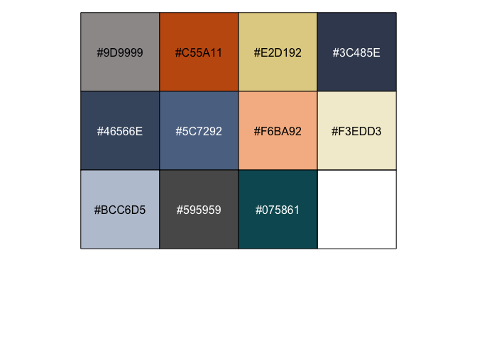

RSG Style Guide
================

The RSG style guide is designed to support Redstone staff in 1. writing
high-quality and reproducible code, and 2. generating compelling
visualizations. This guide is not an introduction to R, the tidyverse,
or Github. We recommend the following resources to get started in R:

  - R for Data Science manual by Hadley Wickham, creator of the
    tidyverse: <https://r4ds.had.co.nz/index.html>
  - The Tidyverse Cookbook:
    <https://rstudio-education.github.io/tidyverse-cookbook/index.html>

## File management

When writing R code - particularly code that will be seen by clients -
it is important to create intuitive file management structures.

Most code management at the scale Redstone typically operates at is done
on Github. Github is a powerful tool for collaborative work with several
important features:

1.  Storage: Github stores code in “repositories”, which are stored in
    the cloud and accessible to those who are given access - either
    everyone (in public repositories) or invited guests (in private
    repositories), analogous to Shared Google Drive folder.
2.  Ownership: Also like Google Drive folders, repositories can easily
    be transfered to different owners. This permits Redstone to create a
    repository through our own account, then later transfer that
    repository to a client at the end of a project.
3.  Collaboration: Github makes it easy for multiple people to edit code
    at the same time. Each individual can work within their own “branch”
    (a copy of the code at a certain timepoint), then merge their edits
    back with a central “master” code. It’s similar to suggest feature
    on Google Docs, except you cannot see the live edits that other
    people are making. Instead, each person makes suggestions
    separately, and they are added to the final doc. In places where
    there are conflicts (e.g., you and another person offered different
    edits of the same sentence), Github will identify the conflict and
    ask you to resolve it. If you plan to be collaborating with others
    in the analysis at the same time, we recommend learning more about
    collaborative editing.
4.  Version control: Like Google Docs, Github retains full details on
    every “commit” (proposed and/or accepted change to the code) for
    reference. This is particularly helpful for programming when code
    “breaks”, and reverting to an earlier version is the simplest way
    to fix the problem.

To start, first ask to be invited to the Redstone organization on
Github. Once in the organization, you can use this guide to Github
(<https://docs.github.com/en/get-started/quickstart/create-a-repo>) that
walks through setting up Github, creating a repository, making edits to
documents, cloning a repository to your local machine, and more.

\[This section will continue to grow as we explore how to best work as
an organization on Github\]

## File types

R code should typically be written in one of two types of files.

R Markdown (.Rmd) files. These files are best when conducting analyses
that can be contained to a single document, and/or which may be shared
with people outside of Redstone. R Markdown files have specific
advantages over .R files:

  - They can be Knit, which runs the entire code and generates a clean
    output file that includes all of the code and the relevant outputs
    (e.g., data tables, graphs, etc.), making it very easy for others to
    see the step-by-step process of loading, cleaning, and analyzing
    data.
  - They allow for written documentation or analysis to easily be
    interspersed with code and analysis, making them useful when you
    want to tell the story of what an analysis is showing.

.R files will typically be most valuable for tasks that are not purely
analysis focused. For example, when developing R packages, web
applications, etc., using .R files may be the most appropriate approach.

## Code style

R is a high-level programming language used primarily for statistical
computing and graphics. The goal of the R Programming Style Guide is to
make our R code easier to read, share, and verify.

Redstone follows Google’s R Programming Style Guide, found here:
<https://google.github.io/styleguide/Rguide.html>. This style guide
draws on work from Hadley Wickham’s tidyverse style guide, found here:
<https://style.tidyverse.org/>. Additionally, Redstone suggests two
additional norms: \* Use the prefix “input\_” for user-defined function
inputs, so that it’s easy to identify inputs in the function body \* Use
the prefix “global\_” for any objects that are subsequently called in
functions from the global environment (rather than as an input)

The example below demonstrates an application of the style guide. Notice
in the code that all functions (for example, aes(), geom\_point()) are
called from the package (using the syntax “ggplot2::”). Those with
experience in R may be tempted to simply load the ggplot2 library,
thereby eliminating the need to call every function from the ggplot2
package. However, the Google R Style Guide recommends the approach below
because it accounts for cases where multiple packages have functions
with the same name (creating confusion in R as to which function R
should call).

``` r
# load the diamonds dataset, included in the ggplot package
# the diamonds dataset contains the prices and other attributes of almost 54,000 diamonds

# this is the only library we load, in order to "pipe" data (use the %>% command) efficiently
library(magrittr)

diamonds <- ggplot2::diamonds

summarized_diamonds <-
  diamonds %>% 
  dplyr::mutate(grouped_carat = round(carat, 1)) %>% 
  dplyr::group_by(cut, grouped_carat) %>% 
  dplyr::summarise(
    avg_price = base::mean(price, na.rm = TRUE),
    count = dplyr::n()
  ) %>% 
  dplyr::filter(count > 10)
```

    ## `summarise()` has grouped output by 'cut'. You can override using the `.groups` argument.

``` r
# display the first ten entries of the dataset
summarized_diamonds %>% head(10)
```

    ## # A tibble: 10 × 4
    ## # Groups:   cut [1]
    ##    cut   grouped_carat avg_price count
    ##    <ord>         <dbl>     <dbl> <int>
    ##  1 Fair            0.3      799.    42
    ##  2 Fair            0.4      928.    42
    ##  3 Fair            0.5     1276.   133
    ##  4 Fair            0.6     1626.    49
    ##  5 Fair            0.7     2071.   238
    ##  6 Fair            0.8     2302.    64
    ##  7 Fair            0.9     3322.   165
    ##  8 Fair            1       4035.   404
    ##  9 Fair            1.1     4366.    46
    ## 10 Fair            1.2     4202.    54

## Visual style

Redstone has developed the rsgtheme package to style visuals generated
in R. This package leverages the tools of the ggthemr package which can
take in a specified palette (in this case, the RSG palette) and generate
visuals according to that palette. Many of the other aspects of the
graphics are pre-set through the function (e.g., gridlines, fonts, axes,
etc.), but can be altered using ggplot2 functions afterward.

Below, we demonstrate how to use the rsgtheme package to create
RSG-style plots.

First, we generate a basic plot using the diamonds dataset.

``` r
rsgtheme::rsgtheme_reset()

summarized_diamonds %>% 
  dplyr::filter(cut == "Ideal") %>% 
  ggplot2::ggplot(ggplot2::aes(x = grouped_carat, y = count)) + 
  ggplot2::geom_col()
```

<!-- -->

We’d like to change the plot to reflect RSG’s visual style. We do this
using the rsgtheme
package.

``` r
# We first run the rsgtheme() function, which changes the default theme for the document
rsgtheme::rsgtheme()

# We then generate the plot
summarized_diamonds %>% 
  dplyr::filter(cut == "Ideal") %>% 
  ggplot2::ggplot(ggplot2::aes(x = grouped_carat, y = count)) + 
  ggplot2::geom_col()
```

<!-- -->

``` r
# We then reset the theme to the default document settings
rsgtheme::rsgtheme_reset()
```

Notice that the rsg\_theme package changes the following attributes of
the chart:

  - Layout: Gridlines, chart background color, axes, etc. have been
    updated to reflect the clean graphical style of RSG. More layout
    options are included below.
  - Color: The color of the chart uses RSG colors. More information on
    how to choose and adjust colors is below.
  - Font: The default font for the package is “Verdana”, a font close to
    the style of Century Gothic that is easily available across
    machines. We are working on instructions to use Century Gothic if
    absolutely necessary.

We can adjust the default chart layout to be as close to our desired
layout as possible by adjusting the input\_layout field of the
rsgtheme() function, as
follows

``` r
# We first run the rsgtheme() function, which changes the default theme for the document
# In this function, we specify the layout. Layout options include: "clean" (the default), "clear", "minimal", "plain", "scientific"

# Clear layout
rsgtheme::rsgtheme(input_layout = "clear")

# We then generate the plot
summarized_diamonds %>% 
  dplyr::filter(cut == "Ideal") %>% 
  ggplot2::ggplot(ggplot2::aes(x = grouped_carat, y = count)) + 
  ggplot2::geom_col()
```

<!-- -->

``` r
# We then reset the theme to the default document settings
rsgtheme::rsgtheme_reset()


# Minimal layout
rsgtheme::rsgtheme(input_layout = "minimal")

# We then generate the plot
summarized_diamonds %>% 
  dplyr::filter(cut == "Ideal") %>% 
  ggplot2::ggplot(ggplot2::aes(x = grouped_carat, y = count)) + 
  ggplot2::geom_col()
```

<!-- -->

``` r
# We then reset the theme to the default document settings
rsgtheme::rsgtheme_reset()


# Plain layout
rsgtheme::rsgtheme(input_layout = "plain")

# We then generate the plot
summarized_diamonds %>% 
  dplyr::filter(cut == "Ideal") %>% 
  ggplot2::ggplot(ggplot2::aes(x = grouped_carat, y = count)) + 
  ggplot2::geom_col()
```

<!-- -->

``` r
# We then reset the theme to the default document settings
rsgtheme::rsgtheme_reset()


# Scientific layout
rsgtheme::rsgtheme(input_layout = "scientific")

# We then generate the plot
summarized_diamonds %>% 
  dplyr::filter(cut == "Ideal") %>% 
  ggplot2::ggplot(ggplot2::aes(x = grouped_carat, y = count)) + 
  ggplot2::geom_col()
```

<!-- -->

``` r
# We then reset the theme to the default document settings
rsgtheme::rsgtheme_reset()
```

There are some special considerations when working with line charts in
particular. To demonstrate, we first generate a basic plot using the
diamonds dataset.

``` r
summarized_diamonds %>% 
  ggplot2::ggplot(ggplot2::aes(x = grouped_carat, y = avg_price, group = cut, color = cut)) + 
  ggplot2::geom_point() +
  ggplot2::geom_line()
```

<!-- -->

We’d like to change the plot to reflect RSG’s visual style. We first
attempt to do this using the rsgtheme() package
alone.

``` r
# We first run the rsgtheme() function, which changes the default theme for the document
rsgtheme::rsgtheme()

# We then generate the plot
summarized_diamonds %>% 
  ggplot2::ggplot(ggplot2::aes(x = grouped_carat, y = avg_price, group = cut, color = cut)) + 
  ggplot2::geom_point() +
  ggplot2::geom_line()
```

<!-- -->

``` r
# We then reset the theme to the default document settings
rsgtheme::rsgtheme_reset()
```

We see that the layout of the chart matches the theme, but the colors
are wrong. This is due to an underlying problem in the ggthemr package
that the rsgtheme() package uses. To address this, we must add a line
specifying that colors should be scaled according to the rsg
theme.

``` r
# We first run the rsgtheme() function, which changes the default theme for the document
rsgtheme::rsgtheme()

# We then generate the plot
summarized_diamonds %>% 
  ggplot2::ggplot(ggplot2::aes(x = grouped_carat, y = avg_price, group = cut, color = cut)) + 
  ggplot2::geom_point() +
  ggplot2::geom_line() + 
  # function to scale colors according to rsg theme
  rsgtheme::scale_color_rsg_d()
```

<!-- -->

``` r
# We then reset the theme to the default document settings
rsgtheme::rsgtheme_reset()
```

The default settings use a pre-defined Redstone color palette. To see
what the default colors are, use getcolors()

``` r
rsgtheme::get_colors()
```

<!-- -->

To adjust the colors in the plot, we recommend specifying a new color
scheme (or a different order of colors) in the rsgtheme() function, as
follows:

``` r
# define a new color palette
new_color_palette <- c("#000000", "#BCC6D5", "#C55A11", "#E2D192", "#075861", "#3C485E", "#F6BA92", "#46566E", "#5C7292", "#F3EDD3", "#595959")

# display the new color palette (if you would like to see what the colors look like together)
scales::show_col(new_color_palette)
```

<!-- -->

``` r
# We first run the rsgtheme() function, which changes the default theme for the document, with the new color palette specified
rsgtheme::rsgtheme(rsg_colors = new_color_palette)

# We then generate the plot
summarized_diamonds %>% 
  ggplot2::ggplot(ggplot2::aes(x = grouped_carat, y = avg_price, group = cut, color = cut)) + 
  ggplot2::geom_point() +
  ggplot2::geom_line() + 
  # function to scale colors according to rsg theme
  rsgtheme::scale_color_rsg_d()
```

<!-- -->

``` r
# We then reset the theme to the default document settings
rsgtheme::rsgtheme_reset()
```

Notice that the non-greyscale colors become the colors of the plot, in
the order that they are specific in the vector.

## Visual style adjustments

A few additional visual style adjustments are required for cleanliness
and legibility. These include:

  - Grid lines- based on the specific visual and/or personal preference
  - Font size - this may requires some trial and error (i.e., reviewing
    the visual produced when saved to a picture, as detailed in the next
    section) to identify the best size, and will vary based on the
    application (e.g., a powerpoint vs. memo)
  - Legend position - based on application and/or personal preference
  - Labels - to clean up the existing text, add a
    title/caption/subtitle, etc.

We can add additional adjustments to this plot using the theme() and
labs() function in
ggplot:

``` r
# We first run the rsgtheme() function, which changes the default theme for the document, with the new color palette specified
rsgtheme::rsgtheme(rsg_colors = new_color_palette)

# We then generate the plot
summarized_diamonds %>% 
  ggplot2::ggplot(ggplot2::aes(x = grouped_carat, y = avg_price, group = cut, color = cut)) + 
  ggplot2::geom_point() +
  ggplot2::geom_line() + 
  # function to scale colors according to rsg theme
  rsgtheme::scale_color_rsg_d() +
  ggplot2::theme(
    # add in major grid lines
    panel.grid.major.y = ggplot2::element_line(color = "grey90"),
    # specify font sizes
    axis.text = ggplot2::element_text(size = 10),
    axis.title = ggplot2::element_text(size = 12),
    legend.text = ggplot2::element_text(size = 10),
    legend.title = ggplot2::element_text(size = 12),
    # adjust position of legend
    legend.position = "bottom",
  ) + 
  # add labels
  ggplot2::labs(
    title = "Average diamond price by carat and cut",
    x = "Carat",
    y = "Average price ($)",
    color = "Cut"
  )
```

<!-- -->

``` r
# We then reset the theme to the default document settings
rsgtheme::rsgtheme_reset()
```

## Noted problems with the rsgtheme package

The rsgtheme package currently does not permit the placement of a legend
overlapping the plot area. We try below to overlap the legend at the
bottom right of the plot by specifying legend.position in the theme()
function; however, the resultant plot contains no legend at
all

``` r
# We first run the rsgtheme() function, which changes the default theme for the document, with the new color palette specified
rsgtheme::rsgtheme(rsg_colors = new_color_palette)

# We then generate the plot
summarized_diamonds %>% 
  ggplot2::ggplot(ggplot2::aes(x = grouped_carat, y = avg_price, group = cut, color = cut)) + 
  ggplot2::geom_point() +
  ggplot2::geom_line() + 
  # function to scale colors according to rsg theme
  rsgtheme::scale_color_rsg_d() +
  ggplot2::theme(
    # add in major grid lines
    panel.grid.major.y = ggplot2::element_line(color = "grey90"),
    # specify font sizes
    axis.text = ggplot2::element_text(size = 10),
    axis.title = ggplot2::element_text(size = 12),
    legend.text = ggplot2::element_text(size = 10),
    legend.title = ggplot2::element_text(size = 12),
    # attempt to position legend on top of plot
    legend.position = c(2.5, 2000),
  ) + 
  # add labels
  ggplot2::labs(
    title = "Average diamond price by carat and cut",
    x = "Carat",
    y = "Average price ($)",
    color = "Cut"
  )
```

<!-- -->

``` r
# We then reset the theme to the default document settings
rsgtheme::rsgtheme_reset()
```

## Saving graphics

We recommend creating images for plots using the ggsave function in the
ggplot2 package. Below is an example of how to save a file to
ggsave.

``` r
# We first run the rsgtheme() function, which changes the default theme for the document, with the new color palette specified
rsgtheme::rsgtheme(rsg_colors = new_color_palette)

# We then generate the plot and SAVE the plot
diamond_plot <-
  summarized_diamonds %>% 
  ggplot2::ggplot(ggplot2::aes(x = grouped_carat, y = avg_price, group = cut, color = cut)) + 
  ggplot2::geom_point() +
  ggplot2::geom_line() + 
  # function to scale colors according to rsg theme
  rsgtheme::scale_color_rsg_d() +
  ggplot2::theme(
    # add in major grid lines
    panel.grid.major = ggplot2::element_line(color = "grey90"),
    # specify font sizes
    axis.text = ggplot2::element_text(size = 10),
    axis.title = ggplot2::element_text(size = 12),
    legend.text = ggplot2::element_text(size = 10),
    legend.title = ggplot2::element_text(size = 12),
    # adjust position of legend
    legend.position = "bottom",
  ) + 
  # add labels
  ggplot2::labs(
    title = "Average diamond price by carat and cut",
    x = "Carat",
    y = "Average price",
    color = "Cut"
  )
 
# We then reset the theme to the default document settings
rsgtheme::rsgtheme_reset()

ggplot2::ggsave(filename = "graphs/diamond_filename.png", plot = diamond_plot, width = 7.5, height = 5)
```

ggsave is recommended for two reasons:

1.  Reproducibility. By defining the specific parameters of the size of
    the image, other folks will be able to generate the same picture
    using your code on their own device. Alternatively, when taking a
    screen shot of the image generated in the RStudio viewer, the
    relative proportions of the image will vary by screen.
2.  Usability. Pictures created in ggsave are saved to the specified
    file and folder, which can be copied and pasted to the appropriate
    document quickly.
